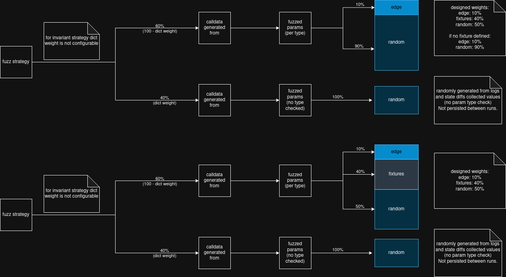

## 模糊测试(Fuzz Testing)

Forge 支持基于属性的测试。

基于属性的测试是一种测试一般行为而不是孤立场景的方法。

让我们通过编写单元测试来检查这意味着什么，找到我们正在测试的一般属性，并将其转换为基于属性的测试：

```solidity
{{#include ../../projects/fuzz_testing/test/Safe.t.sol.1:all}}
```

运行测试，我们看到它通过了：

```sh
{{#include ../output/fuzz_testing/forge-test-no-fuzz:all}}
```

这个单元测试_确实测试_我们可以从我们的保险箱（Safe 合约）中取出以太币。 但是，谁能说它适用于所有金额，而不仅仅是 1 个以太币？

这里的一般性质是：给定一个安全的余额，当我们提取时，我们应该得到保险箱里的所有的资金。

Forge 将运行任何至少采用一个参数的测试作为基于属性的测试，所以让我们重写：

```solidity
{{#include ../../projects/fuzz_testing/test/Safe.t.sol.2:contract_prelude}}
    // ...

{{#include ../../projects/fuzz_testing/test/Safe.t.sol.2:test}}
}
```

如果我们现在运行测试，我们可以看到 Forge 运行基于属性的测试，但它因 amount 的高值而失败：

```sh
$ forge test
{{#include ../output/fuzz_testing/forge-test-fail-fuzz:output}}
```

给测试合约的默认以太币数量是 `2**96 wei`（在 DappTools 中），所以我们必须将 amount 类型限制为 `uint96` ，以确保我们不会尝试发送超过`uint96`的值， 我们使用参数：

```solidity
{{#include ../../projects/fuzz_testing/test/Safe.t.sol.3:signature}}
```

现在它通过了：

```sh
{{#include ../output/fuzz_testing/forge-test-success-fuzz:all}}
```

您可能希望使用 [`assume`](../cheatcodes/assume.md) 作弊码排除某些情况。 在这些情况下，模糊器 fuzzer 将丢弃输入并开始运行新的模糊测试：

```solidity
function testFuzz_Withdraw(uint96 amount) public {
    vm.assume(amount > 0.1 ether);
    // snip
}
```

有多种方法可以运行基于属性的测试，特别是参数测试和模糊测试。 Forge 仅支持模糊测试。

### 解读结果

您可能已经注意到，与单元测试相比，模糊测试的总结略有不同：

- "runs" 是指模糊器 fuzzer 测试的场景数量。 默认情况下，模糊器 fuzzer 将生成 256 个场景，但用户可以设置此参数以及其他测试执行参数。有关模糊测试器配置详细信息，请参阅 [`这里`](#configuring-fuzz-test-execution)。
- “μ”（希腊字母 mu）是所有模糊运行中使用的平均 Gas
- “~”（波浪号）是所有模糊运行中使用的中值 Gas

### 配置模糊测试执行

模糊测试执行受用户通过 Forge 配置原语控制的参数的约束。配置可以全局应用，也可以基于每个测试进行应用。有关此主题的详细信息，请参阅
 📚 [`全局配置`](../reference/config/testing.md) 和 📚 [`内联配置`](../reference/config/inline-test-config.md)。

 #### 模糊测试固定装置

当你想确保一组特定的值被用作模糊参数的输入时，可以定义模糊测试固定装置。
这些固定装置可以在测试中被声明为：

- 以 `fixture` 为前缀的存储数组，后跟要进行模糊处理的参数名称。例如，要用于模糊处理 `uint32` 类型的参数 `amount` 的固定装置可以定义如下：

```solidity
uint32[] public fixtureAmount = [1, 5, 555];
```

- 以 `fixture` 为前缀命名的函数，后跟要进行模糊处理的参数名称。函数应返回一个（固定大小或动态的）数组，作为模糊处理所需的值。例如，要用于模糊处理名称为 `owner` 的 `address` 类型的参数的固定装置可以定义为具有以下签名的函数：

```solidity
function fixtureOwner() public returns (address[] memory)
```

如果提供的固定值的类型与要进行模糊处理的命名参数的类型不一致，则会被拒绝并引发错误。

一个使用固定装置的例子是复现 `DSChief` 漏洞。考虑以下两个函数：

```solidity
    function etch(address yay) public returns (bytes32 slate) {
        bytes32 hash = keccak256(abi.encodePacked(yay));

        slates[hash] = yay;

        return hash;
    }

    function voteSlate(bytes32 slate) public {
        uint weight = deposits[msg.sender];
        subWeight(weight, votes[msg.sender]);
        votes[msg.sender] = slate;
        addWeight(weight, votes[msg.sender]);
    }
```

该漏洞可以通过在调用 `etch` 之前调用 `voteSlate`，使用 `yay` 地址的哈希值作为 `slate` 值来重现。
为了确保模糊测试器在同一轮运行中包含从 `yay` 地址派生的 `slate` 值，可以定义以下固定装置：

```solidity
    address[] public fixtureYay = [
        makeAddr("yay1"),
        makeAddr("yay2"),
        makeAddr("yay3")
    ];

    bytes32[] public fixtureSlate = [
        keccak256(abi.encodePacked(makeAddr("yay1"))),
        keccak256(abi.encodePacked(makeAddr("yay2"))),
        keccak256(abi.encodePacked(makeAddr("yay3")))
    ];
```

以下图片显示了模糊测试器在声明固定装置前后的值生成情况：
